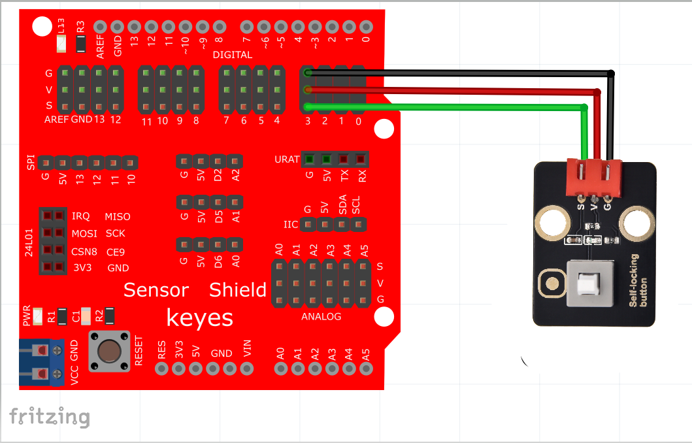

# Arduino


## 1. Arduino简介  

Arduino是一种开源电子原型平台，旨在帮助用户进行互动项目的开发。它由硬件和软件两个部分组成，提供了丰富的开发环境和灵活的接口。Arduino支持多种传感器和模块，用户可以通过简单的编程（基于C/C++语言）构建各种项目。Arduino的设计理念强调对初学者的友好性，提供了大量的教程和社区支持，使得学习电子原理和编程技术变得简单而有趣。  

## 2. 接线图  

  

## 3. 测试代码（测试软件版本：Arduino 1.8.12）  

```arduino  
int ledPin = 13; // 定义数字口13  
int inputPin = 3; // 定义数字口3  

void setup() {  
    pinMode(ledPin, OUTPUT); // 将ledPin设置为输出  
    pinMode(inputPin, INPUT); // 将inputPin设置为输入  
}  

void loop() {  
    int val = digitalRead(inputPin); // 读取数字口3的数值并赋值给 val  
    if (val == LOW) { // 当val为低电平时，LED亮起  
        digitalWrite(ledPin, HIGH); // LED亮起  
    } else {  
        digitalWrite(ledPin, LOW); // LED变暗  
    }  
}  
```  

## 4. 代码说明  

1. `pinMode(button, INPUT);`   
   在这里我们定义按键管脚为数字口2，设置为输入模式。通过`pinMode()`配置为INPUT的Arduino（ATmega）引脚处于高阻抗状态。配置为INPUT的引脚对采样电路的要求极小，便于读取传感器。  

2. `Serial.begin(9600);`   
   初始化串口通信，并设置波特率为9600。  

3. `digitalRead(button);`   
   读取按键的数字电平，返回HIGH或LOW，如果引脚未连接任何东西，则返回值可能会随机变化。  

4. `if..else..`语句：   
   当`if`后面的条件为真时，执行大括号里的代码；否则执行`else`后面{}里的代码。  

5. 代码逻辑是传感器感应到按键按下时，信号端为低电平，D2口为低电平，即val为0，这时LED亮起；反之，当信号为高电平时，LED熄灭。  

## 5. 测试结果  

按照上图接好线，烧录好代码；上电后，按下按键后，板载LED亮起，放开按键后，LED熄灭。


