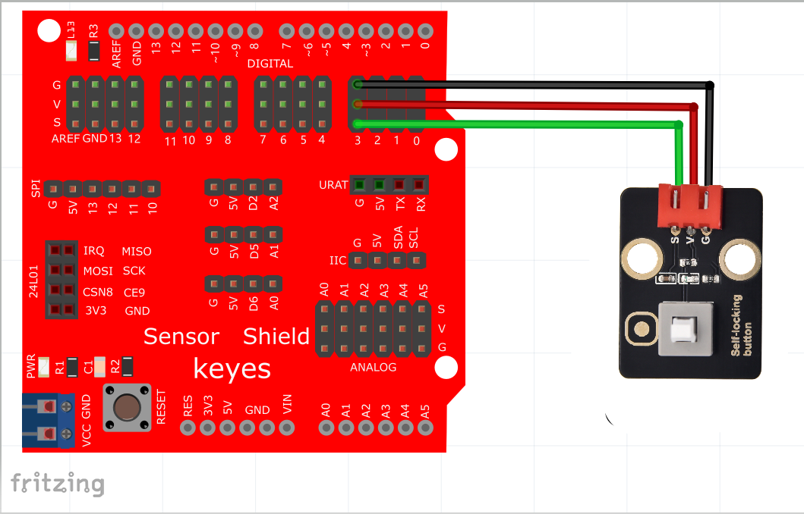

# KidsBlock

## 1. KidsBlock简介  

KidsBlock是一款面向儿童和初学者的图形化编程学习平台，旨在通过简单易用的方式引导用户了解编程和电子原理。它结合了图形化编程界面和实际硬件，用户可以通过拖放模块创建代码，从而轻松控制各种电子设备和传感器。KidsBlock支持多种编程语言，包括Scratch和Arduino C，提供丰富的示例和教程，使得学习编程变得有趣且容易。该平台特别适合在教育环境中使用，帮助学生培养逻辑思维和创造力。  

## 2. 接线图  

  

## 3. 测试代码  

  

## 4. 代码说明  

1. 在变量类型单元中找到，将item变量名改为“button”，这个修改是为了更好地理解与记忆。设置button初始变量为整数，并赋值为0。  

2. 初始化设置波特率为9600，表示串口通信的传输速度为9600位每秒。  

3. 在引脚单元中找到，使该管脚设置为3，并设置为输入模式，以读取按键的值。  

4. 在控制单元中找到条件控制语句，如果...否则...，填入button和“0”以判断按键是否被按下。如果按键被按下，则输出相应的信息。  

5. 整个代码逻辑是当传感器感应到按键按下时，button为0，串口监视器显示“Press the button”；松开按键时，button为1，显示“Loosen the button”。  

## 5. 测试结果  

成功上传测试代码后，利用USB进行供电，串口监视器显示对应数据和字符。当按下按键时，button为0，显示“Press the button”；松开按键时，button为1，显示“Loosen the button”，如下图。  

