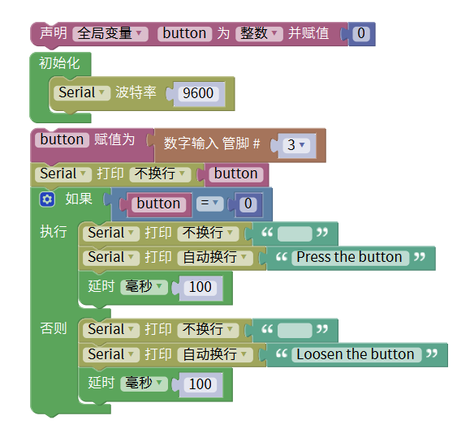
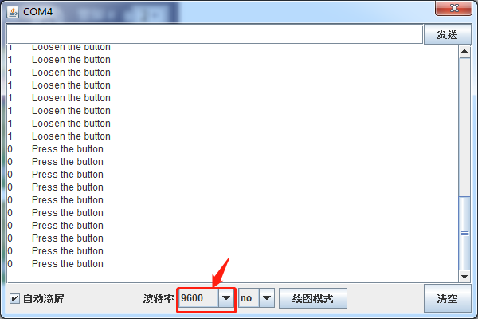

# Mixly

## 1. Mixly简介  

Mixly是一款可视化编程软件，为用户提供了简单直观的方式来学习和使用编程。它适用于Arduino、Micro:bit等硬件平台，使得初学者能够通过拖放模块来构建程序，而无需深入了解编程语言的具体语法。此软件包含了丰富的内置库，支持多种控件和功能，帮助用户轻松实现各种项目，如传感器控制、灯光闪烁和用户交互等。Mixly的设计使得教育工作者和学生在课堂上能够更有效地参与到编程和电子创作中。  

## 2. 接线图  

  

## 3. 测试代码（测试软件版本：Mixly 1.2.0）  

  

## 4. 代码说明  

1. 在单元中找到，将item变量名改为“button”。这里修改变量名是为了便于理解与记忆，设置button初始变量为整数，并赋值为0。  

2. 初始化设置波特率为9600，波特率是串口通信传输的速度，表示9600位每秒。  

3. 在输入/输出模块中找到并拖出数字输入管脚，并将管脚设置为3，读取到D3管脚的按键值赋值给变量button。  

4. 找到并拉出串口模块下的打印代码块，将自动换行改为不换行，并打印变量button。  

5. 在单元内设置“如果...否则...”逻辑单元，实验中只需添加一个否则单元。代码逻辑是当传感器感应到按键按下时，button为0，串口监视器显示相关字符；按键松开时，button为1，显示其他字符。  

## 5. 测试结果  

上传测试代码成功后，利用USB供电并打开串口监视器，设置波特率为9600。实验中，当传感器按下按键时，button为0，串口监视器显示“Press the button”；按键松开时，button为1，串口监视器显示“Loosen the button”，如下图。  

