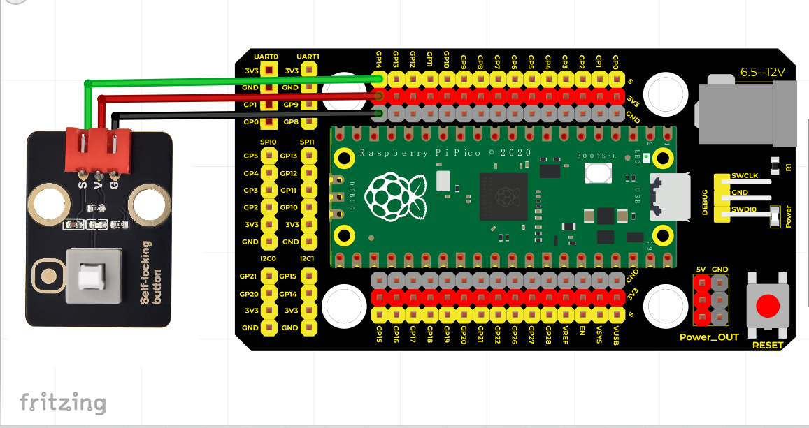

# Python


## 1. Python简介  

Python是一种跨平台的高级编程语言，以其简洁的语法和强大的功能而受到广泛欢迎。自1980年代末首次发布以来，Python已成为科学计算、数据分析、人工智能、Web开发等领域的首选语言之一。它支持多种编程范式，包括面向对象、过程式和函数式编程，使得开发者能够根据需求自由选择编程风格。Python拥有丰富的标准库以及第三方库，如NumPy、Pandas和TensorFlow等，极大地扩展了其应用范围。由于其易读性和较低的学习曲线，Python特别适合于教育和初学者的编程学习。  

## 2. 接线图  

  

## 3. 测试代码  

```python  
import machine  
import utime  

led_external = machine.Pin(25, machine.Pin.OUT)  # 设置GPIO25为输出  
button = machine.Pin(14, machine.Pin.IN, machine.Pin.PULL_UP)  # 设置GPIO14为按键输入  

# 延时函数  
while True:  
    if button.value() == 0:  # 判断按键是否按下  
        led_external.value(1)  # 点亮板载LED灯  
        utime.sleep(0.2)  # 延时0.2S  
        led_external.value(0)  # 熄灭板载LED灯  
```  

## 4. 代码说明  

1. `import machine` 和 `import utime`：导入用于硬件控制及时间控制的库。  

2. `led_external = machine.Pin(25, machine.Pin.OUT)`：将GPIO25设置为输出模式，控制外部LED的状态。  

3. `button = machine.Pin(14, machine.Pin.IN, machine.Pin.PULL_UP)`：将GPIO14设置为输入模式，并配置为上拉电阻，确保无按键按下时，电平为高。  

4. `while True`: 启动一个无限循环，实时监测按键状态。  

5. `if button.value() == 0`：检查按键是否被按下，当按键按下时，执行点亮LED的操作。  

6. `led_external.value(1)` 和 `led_external.value(0)`：分别用于点亮和熄灭LED灯，以实现指示效果。  

## 5. 测试结果  

接线图如上所示，运行程序后，当按下按键时，PICO板载的LED灯亮起，松开按键时，LED灯熄灭。该实验展示了如何使用按钮控制LED的基本原理，适用于多种电子应用场景。


